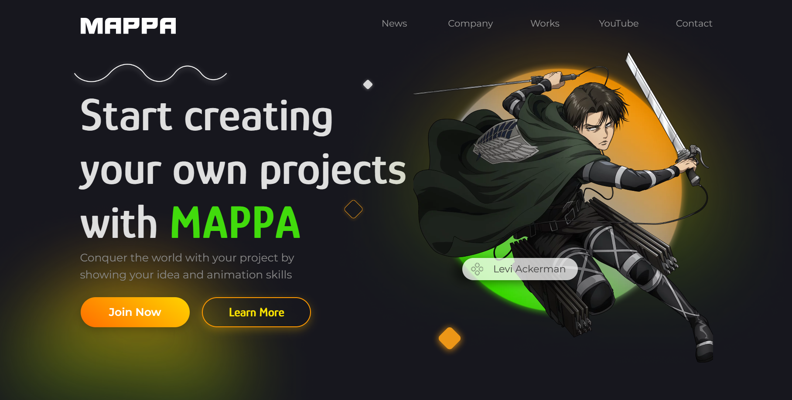
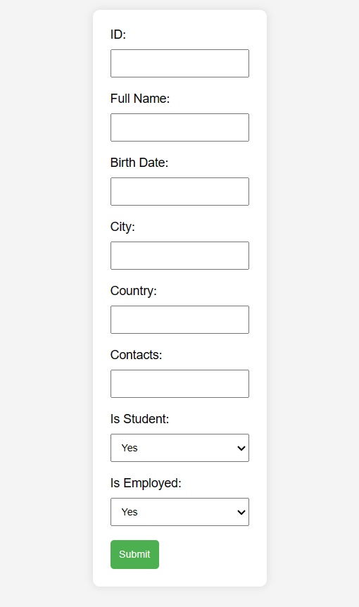

# Project Theme: Animation Studio


## Brief Project Description

Animation Studio started their reqruitment for the talented animatiors and designers. The company provides an opportunity for the people to start their projects with their new forming teams. 

## Participants

- Aralbayev Rasul

### Homepage


## Screenshots


## Launching the Application

### Prerequisites

- Node.js: [Install Node.js](https://nodejs.org/)
- MongoDB: [Install MongoDB](https://www.mongodb.com/try/download/community)

### Installation

1. Clone the repository:

   ```bash
   git clone https://github.com/team-awesome/blog.git
   cd blog
